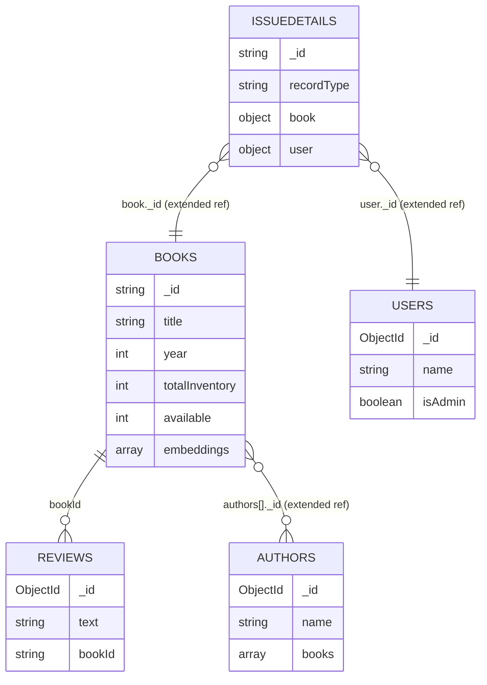

# EDD — Entity Document Diagram

Database name is set by `DATABASE_NAME` (default `library` locally, `testLibrary` in
tests), connected via `server/src/database.ts`.

Field types below were derived from the seeded documents in
`.devcontainer/data/library/*.bson` (sampled with `bsondump`) and the TypeScript
interfaces in `server/src/models/`, not from a formal schema — the driver applies no
JSON Schema validators.

## Entity overview

| Collection | Written by | Read by | Vector index |
| --- | --- | --- | --- |
| `books` | `routes/books.ts`, `routes/reviews.ts` (appends to the embedded `reviews` subset) | `routes/books.ts`, `routes/authors.ts` | `search-indexing/*.ts` create `fulltextsearch` and `vectorsearch*` indexes on this collection (not present by default) |
| `authors` | not written by the app (seed data only) | `routes/authors.ts`, `routes/books.ts` (extended reference) | — |
| `reviews` | `routes/reviews.ts` | `routes/reviews.ts` | — |
| `users` | not written by the app (seed data only) | `routes/users.ts`, extended reference in `issueDetails` | — |
| `issueDetails` | `routes/borrows.ts`, `routes/reservations.ts` | `routes/borrows.ts`, `routes/reservations.ts` | — |

## books

One book per ISBN. Combines several documented MongoDB schema patterns (comments in
[server/src/models/book.ts](server/src/models/book.ts) link to each).

| Field | Type | Notes |
| --- | --- | --- |
| `_id` | string | ISBN, used as the primary key instead of an ObjectId |
| `title` | string | |
| `longTitle` | string | optional |
| `year` | int | |
| `pages` | int | optional |
| `synopsis` | string | optional |
| `publisher` | string | optional |
| `language` | string | optional |
| `binding` | string | optional |
| `cover` | string | optional, cover image URL |
| `genres` | array\<string\> | optional |
| `totalInventory` | int | |
| `available` | int | computed field (Computed Pattern) — not derived from a query, must be kept in sync by writers |
| `authors` | array\<{ _id: ObjectId, name: string }\> | Extended Reference Pattern into `authors` |
| `attributes` | array\<{ key: string, value: string }\> | Attribute Pattern (edition, ISBN-10/13, dimensions, MSRP, …) |
| `reviews` | array\<review subset\> | Subset Pattern — duplicates a copy of each review (minus `_id`/`bookId`) inline for fast reads |
| `bookOfTheMonth` | boolean | optional, added for the Search Lab |
| `embeddings` | array\<double\>, len 1408 | ⚠️ referenced by every script in `search-indexing/` as the vector field, but **absent from the base seed data** — only present on documents processed by the embeddings workshop lab. See *Known inconsistencies*. |

No indexes beyond `_id` in the base seed; the search-indexing lab scripts add
`fulltextsearch` / `vectorsearch` / `vectorsearch-prefilter` / `vectorsearch-quantized`
Atlas Search indexes on demand.

## authors

| Field | Type | Notes |
| --- | --- | --- |
| `_id` | ObjectId | |
| `name` | string | |
| `sanitizedName` | string | lowercased, no punctuation, used for lookups |
| `aliases` | array\<string\> | |
| `bio` | string | optional |
| `books` | array\<string\> | ISBNs, reference to `books._id` |

Indexes: `_id`, plus a compound `_id_1_books_1` present in the seed data (unusual —
see *Known inconsistencies*).

## reviews

Standalone collection. A duplicate/denormalized copy of each review also lives inline
in `books.reviews` (Subset Pattern) — the two are not kept in sync by a transaction,
only by both being written from the same request handler.

| Field | Type | Notes |
| --- | --- | --- |
| `_id` | ObjectId | |
| `text` | string | ⚠️ typed as required in `Review`, but ~0.9% of seeded documents have `text: null`. See *Known inconsistencies*. |
| `name` | string | reviewer display name, free text |
| `rating` | int | optional in the model |
| `timestamp` | number \| Date | stored as a BSON date in the standalone collection but as an epoch-millisecond double in the embedded `books.reviews` subset — see *Known inconsistencies* |
| `bookId` | string | reference to `books._id` |

Indexes: `_id`, plus compound `_id_1_bookId_1`.

## users

| Field | Type | Notes |
| --- | --- | --- |
| `_id` | ObjectId | |
| `name` | string | |
| `isAdmin` | boolean | optional, gates `adminRoute` middleware |

No password/credential field — `routes/users.ts` issues a token from `name` alone
(workshop-simplified auth, not production auth).

## issueDetails

Single-Collection Pattern: one collection holds two record shapes, discriminated by
`recordType`.

| Field | Type | Notes |
| --- | --- | --- |
| `_id` | string | format `<userObjectId><bookISBN>`, e.g. `64d4c964f0d056ea6bf0f3d8B0864425813` — lets `find({ _id: /^userId/ })` query by user without a secondary index |
| `recordType` | `'borrowedBook'` \| `'reservation'` | |
| `book` | { _id: string, title: string } | Extended Reference into `books` |
| `user` | { _id: ObjectId, name: string } | Extended Reference into `users` |
| `borrowDate`, `dueDate` | Date | `recordType: 'borrowedBook'` only |
| `returned` | boolean | `recordType: 'borrowedBook'` only |
| `returnedDate` | Date | `recordType: 'borrowedBook'` only, set once returned |
| `expirationDate` | Date | `recordType: 'reservation'` only; intended for a TTL index per the code comment, but no TTL index exists in the seed data — see *Known inconsistencies* |

Index: `{ 'user._id': 1, returnedDate: 1, borrowDate: 1 }`, created and explained by
[server/src/indexing/borrowed-books-index.ts](server/src/indexing/borrowed-books-index.ts).

## Relationships

All relationships are **logical only** — no foreign keys, no schema validators, no
indexes beyond `_id` and the compound indexes noted above.

## Known inconsistencies

1. **`books.embeddings` is documented by four scripts but absent from the shipped
   seed data.** `search-indexing/vector-search.ts`, `prefilter.ts`, and
   `quantization.ts` all assume a `books.embeddings` field with 1408 dimensions, but
   none of the 6,777 seeded book documents contain it — it's populated by running the
   (separate, unseen-here) embeddings workshop lab against `EMBEDDINGS_SOURCE`. An
   agent that seeds data and immediately runs vector search will get zero results, not
   an error. Update this entry if a seed/embeddings step is added.

2. **A `reviews.text` field is nullable in practice (~0.9% of seed documents:
   35/4036) despite `Review.text` being typed as a required `string`.** Code that
   renders `review.text` without a null check will render `null`/blank rather than
   throw. Update this entry if the model is changed to `text?: string | null`.

3. **`reviews.timestamp` has two different physical representations**: a BSON `Date`
   in the standalone `reviews` collection, but an epoch-millisecond `double` in the
   copy embedded under `books.reviews[]` (the Subset Pattern duplicate). Code reading
   the embedded copy must not assume it can call `Date` methods on `timestamp`
   directly. Update this entry if the two are reconciled.

4. **An `operations` collection exists in the seed data (`.devcontainer/data/library/operations.bson`,
   2,321 documents) with the exact same shape as `issueDetails`, but no model, route,
   controller, or reference to it exists anywhere in `server/src/`.** It appears to be
   data left over from an earlier name for the `issueDetails` collection. It is
   imported by `.devcontainer/import.sh` on every codespace/devcontainer start but
   never read or written by the app. Update this entry (or remove the stale collection
   from the seed data) once confirmed safe to drop.

5. **`authors` has a compound index `{ _id: 1, books: 1 }`** in the seed data even
   though `_id` alone is already unique — the `books` component adds no selectivity
   for any query in `routes/authors.ts`. Confirm whether this supports a query not
   present in the current codebase before removing it.
