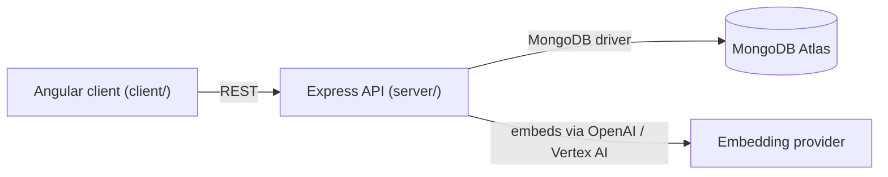

# Library Management System

[](https://codespaces.new/mongodb-developer/library-management-system)

A full-stack library app — browse a catalog, borrow and reserve books, leave reviews —
built on the MEAN stack (MongoDB, Express, Angular, Node.js). It's the sample app used
in MongoDB Developer Days hands-on labs, so the codebase intentionally shows off
several MongoDB schema design patterns and Atlas Search / Vector Search side by side,
not just CRUD.

## Capabilities

- Browse, add, edit, and delete books, each with authors, genres, and free-form
  attributes (edition, ISBN, dimensions, MSRP)
- Borrow and return books, with due dates and history, or reserve a book that's
  currently checked out
- Leave and read reviews per book
- Role-based access: admin-only routes for managing inventory and borrow records
- Workshop labs for full-text and vector search over the book catalog, including
  prefiltering and scalar quantization variants of a Vector Search index

## Architecture overview



The client is a standalone Angular SPA; the server is an Express + TypeScript API. The
two talk over HTTP only — there's no server-side rendering or shared process. The
server owns all MongoDB access; embedding generation for search is a pluggable
provider selected at runtime (see [AGENTS.md](./AGENTS.md)).

## Quick start

### Option A — GitHub Codespaces (recommended)

Click the badge above, or **Code → Codespaces → Create codespace on main**. The
devcontainer will:

- Start a local MongoDB Atlas container and restore the sample library data
- Install server and client dependencies
- Open three terminal tabs running the server, the client, and port setup

Once it's done, open the forwarded port for **4200** (opens automatically).

### Option B — Local machine

Prerequisites: Node.js 20+, npm, and a MongoDB cluster (an
[Atlas free tier (M0) cluster](https://www.mongodb.com/cloud/atlas/register?utm_campaign=devrel&utm_source=github&utm_medium=referral&utm_content=library_management_system&utm_term=learning.fuel)
works, or a local `mongod`).

```bash
git clone git@github.com:mongodb-developer/library-management-system.git library
cd library
npm install
```

Set your connection details in `server/.env` (already committed with working defaults
for a local database — edit `DATABASE_URI` if you're pointing at Atlas instead):

```
PORT=5400
DATABASE_URI=mongodb://localhost:27017
DATABASE_NAME=library
SECRET=secret
```

Start the server:

```bash
cd server && npm install && npm start
```

In a second terminal, start the client:

```bash
cd client && npm install && npm start
```

Open http://localhost:4200 — you should see the book catalog load.

## MongoDB features demonstrated

### Why MongoDB?

- **Flexible schema for a catalog with wildly inconsistent source data.** Books come
  with different attributes depending on edition and publisher; the
  [Attribute Pattern](https://www.mongodb.com/blog/post/building-with-patterns-the-attribute-pattern?utm_campaign=devrel&utm_source=github&utm_medium=referral&utm_content=library_management_system&utm_term=learning.fuel)
  stores those as key/value pairs instead of a rigid column set.
- **Reads that don't fan out.** A book page needs its authors and recent reviews in
  one round trip; the
  [Extended Reference](https://www.mongodb.com/blog/post/building-with-patterns-the-extended-reference-pattern?utm_campaign=devrel&utm_source=github&utm_medium=referral&utm_content=library_management_system&utm_term=learning.fuel)
  and
  [Subset](https://www.mongodb.com/blog/post/building-with-patterns-the-subset-pattern?utm_campaign=devrel&utm_source=github&utm_medium=referral&utm_content=library_management_system&utm_term=learning.fuel)
  patterns duplicate just enough of that related data inline to avoid a join-like
  lookup on every page view.
- **One collection instead of two nearly-identical ones.** Borrowed books and
  reservations differ by only a few fields, so the
  [Single Collection Pattern](https://www.mongodb.com/blog/post/building-with-patterns-the-single-collection-pattern?utm_campaign=devrel&utm_source=github&utm_medium=referral&utm_content=library_management_system&utm_term=learning.fuel)
  keeps them together and discriminates with a `recordType` field.
- **Search and recommendations without a second database.**
  [Atlas Search](https://www.mongodb.com/docs/atlas/atlas-search/?utm_campaign=devrel&utm_source=github&utm_medium=referral&utm_content=library_management_system&utm_term=learning.fuel)
  and
  [Atlas Vector Search](https://www.mongodb.com/docs/atlas/atlas-vector-search/?utm_campaign=devrel&utm_source=github&utm_medium=referral&utm_content=library_management_system&utm_term=learning.fuel)
  run against the same `books` collection the app already reads and writes — no
  separate search cluster to keep in sync.

## Contributing

Merge your own PR once you have at least one approval from a
[code owner](.github/CODEOWNERS).

## License

This project is licensed under the [Apache 2.0 License](LICENSE). Use at your own
risk — not a supported MongoDB product.

## Getting support

If you run into a problem working through this app,
[open a new issue](https://github.com/mongodb-developer/library-management-system/issues/new).
